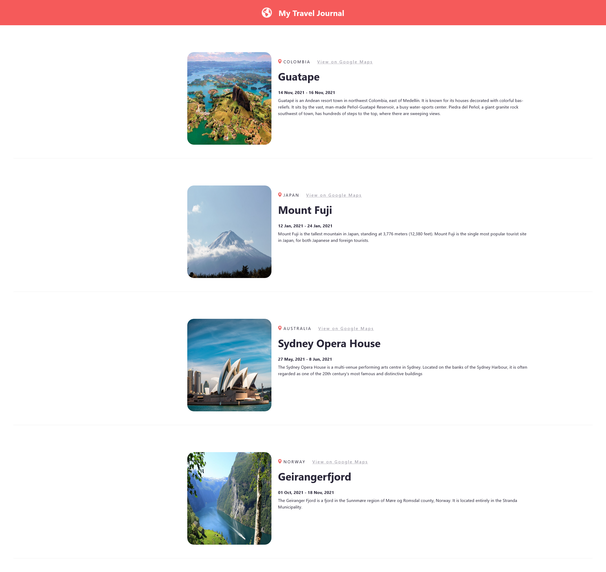

# Travel-Journal (ReactJS)

# Screenshot

# About
A Travel Journal, created to practice ReactJS. The travel journal includes descriptions of places where a user has visited. Journal Entries contain Title, Location, Google Maps Link, Start Date, End Date, Description and Image. 
The entries are created using the .map() method with props on the data.js file, which is an array of objects. The purpose of this project was to While about React Props, creating components from an array, using mapping components, etc. After creating the project, it was deployed to github-pages.

#Features/Components
- ReactJS
- Custom Components
- create-react-app
- Figma
- React Props
- Creating Components from an Array
- Mapping Components
- github-pages
